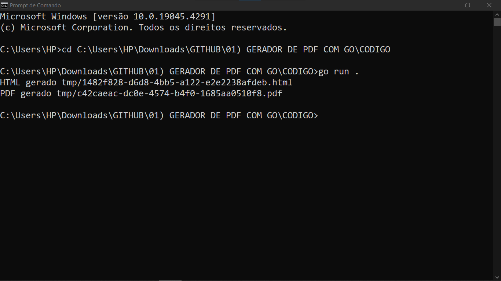
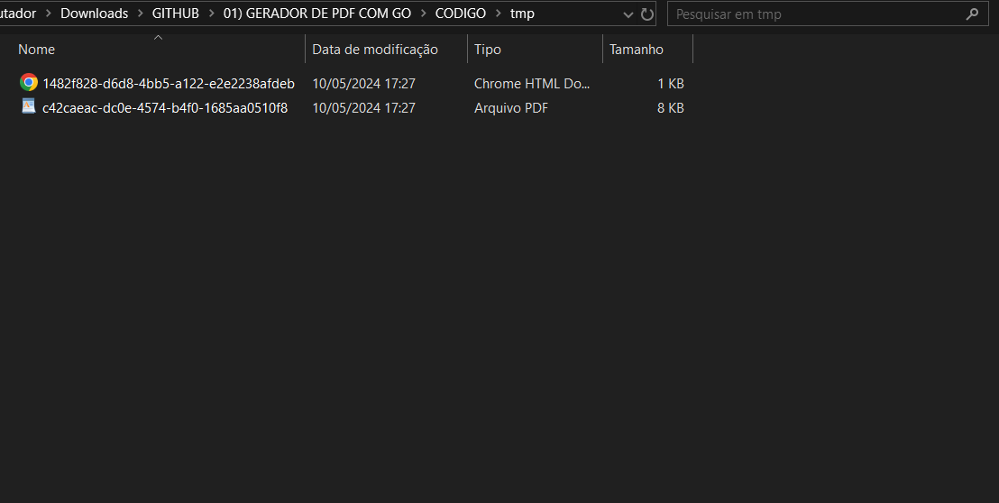
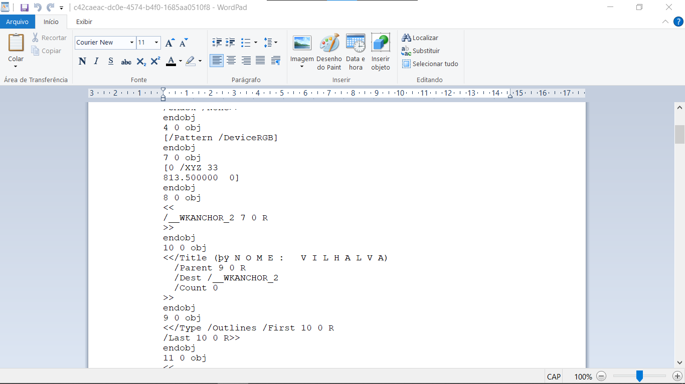

# GERADOR DE PDF COM GO
👨‍🏫GERADOR DE PDF E HTML COM GOLANG.

 <br>
 <br>
 <br>
 <br>

## DESCRIÇÃO:
Este aplicativo foi desenvolvido em Go (Golang) e é responsável por gerar arquivos PDF e HTML apartir do simples comando de execução. Ele utiliza a biblioteca `go-wkhtmltopdf`, que é uma interface para a ferramenta `wkhtmltopdf`, para realizar a conversão.

A funcionalidade principal do aplicativo é receber um arquivo HTML como entrada, geralmente localizado em `./CODIGO/templates/exemplo.html`, e em seguida, utilizar a ferramenta `wkhtmltopdf` para converter esse arquivo em um PDF. Além disso, o HTML e o PDF gerados são salvos no sistema de arquivos, cada um com um nome único, composto por um identificador UUID, na pasta `./CODIGO/tmp`.

## EXECUTANDO O PROJETO:
1. **Instalação do `wkhtmltopdf`**: 
   - Você precisa instalar o `wkhtmltopdf` no seu sistema. Você pode baixar o executável mais recente do [site oficial do `wkhtmltopdf`](https://wkhtmltopdf.org/downloads.html) e seguir as instruções de instalação para o seu sistema operacional.

2. **Adicionando o diretório do `wkhtmltopdf` ao PATH**:
   - Após a instalação, adicione o diretório onde o executável `wkhtmltopdf` está localizado ao seu PATH. Geralmente, esse diretório fica em `C:\Program Files\wkhtmltopdf\bin`. Isso permitirá que o sistema encontre o executável quando você executar o seu programa em Go.

3. **Comandos Disponíveis**:
   - Execute o seguinte comando no terminal para gerar HTML:
   ```bash
   go run .
   ```
   ou
   ```bash
   go run main.go
   ```

   - Você verá no terminal uma saída semelhante a esta:
   ```
   HTML gerado tmp/1482f828-d6d8-4bb5-a122-e2e2238afdeb.html
   PDF gerado tmp/c42caeac-dc0e-4574-b4f0-1685aa0510f8.pdf
   ```

4. **Visualizando o Resultado**:
   - Tanto o arquivo HTML quanto o PDF estarão disponíveis em `./CODIGO/tmp`. Ao abrir, você verá:
   ```
   NOME: VILHALVA
   ```

5. **Personalização**:
   - Se desejar, você pode personalizar os dados gerados abrindo `./CODIGO/main.go` na linha 19 e modificando o valor de `Name`.
   ```go
    dataHTML := Data{
    Name: "VILHALVA",
	 }  
   ```

   - Além disso, você pode personalizar o template HTML abrindo `./CODIGO/templates/exemplo.html` na linha 09 e modificando o conteúdo conforme necessário.
   ```html
   <body>
   <h2>NOME: {{.Name}}</h2>
   </body>
   ```
   
## BIBLIOTECAS USADAS:
- [UUID](https://github.com/google/uuid): Uma biblioteca para geração de identificadores únicos universais (UUID) em Go.
- [GO-WKHTMLTOPDF](https://github.com/SebastiaanKlippert/go-wkhtmltopdf): Uma interface em Go para a ferramenta `wkhtmltopdf`, que permite a conversão de arquivos HTML para PDF.

## NÃO SABE?
- Entendemos que para manipular arquivos em muitas linguagens e tecnologias, é necessário possuir conhecimento nessas áreas. Para auxiliar nesse aprendizado, oferecemos cursos gratuitos disponíveis:
* [CURSO DE GOLANG](https://github.com/VILHALVA/CURSO-DE-GOLANG)
* [CURSO DE HTML E CSS](https://github.com/VILHALVA/CURSO-DE-HTML-E-CSS)
* [CONFIRA MAIS CURSOS](https://github.com/VILHALVA?tab=repositories&q=+topic:CURSO)

## CREDITOS:
- [PROJETO FEITO PELO VILHALVA](https://github.com/VILHALVA)
- [VEJA O VIDEO DESSE PROJETO](https://youtube.com/playlist?list=PLm-xZWCprwYQ3gyCxJ8TR1L2ZnUOPvOpr&si=XTq8PNuNWZTV-pho)
